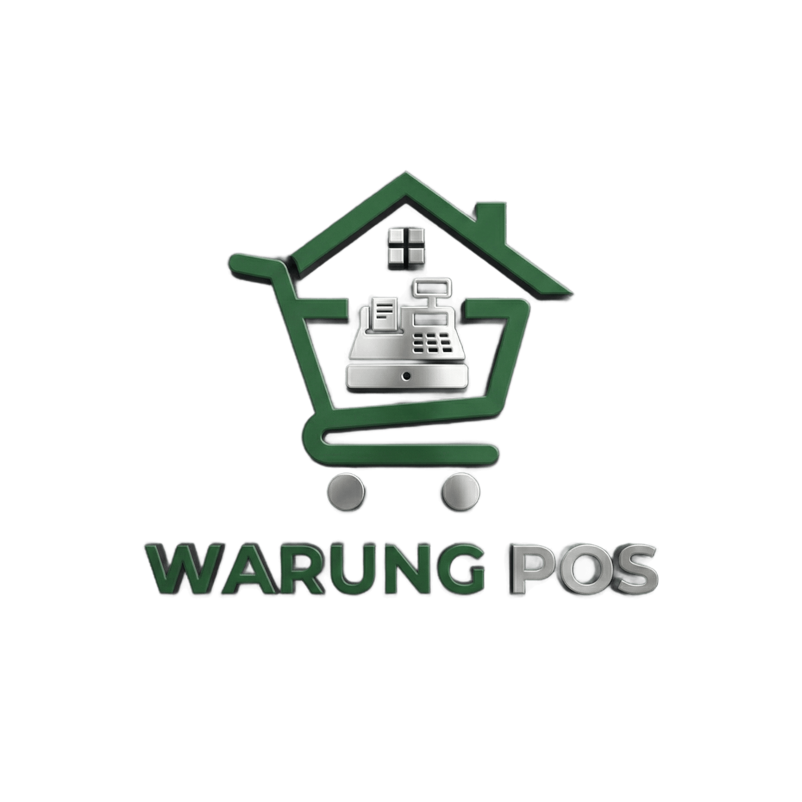

# WarungPOS - Aplikasi Kasir Modern untuk UMKM



Aplikasi Point of Sale (POS) modern berbasis web yang dirancang khusus untuk kebutuhan warung, toko retail, dan UMKM di Indonesia. Dilengkapi dengan fitur lengkap untuk manajemen produk, transaksi, hutang pelanggan, karyawan, dan pelaporan.

## 🌟 Fitur Utama

### 💰 Kasir & Transaksi

- **Kasir Responsif** - Interface yang cepat dan mudah digunakan untuk transaksi
- **Keranjang Belanja** - Tambah, edit, hapus item dengan mudah
- **Multiple Price Type** - Harga eceran dan grosir
- **Pencarian Produk** - Cari produk berdasarkan nama atau SKU
- **Filter Kategori** - Filter produk berdasarkan kategori
- **Cetak Struk** - Print struk pembayaran otomatis
- **Pembayaran Tunai/Hutang** - Flexible payment options

### 📦 Manajemen Produk

- **CRUD Produk Lengkap** - Tambah, edit, hapus produk
- **Import dari CSV** - Upload produk massal via CSV dengan template
- **SKU Otomatis** - Generate SKU dengan prefix kategori
- **Manajemen Stok** - Tambah/kurangi stok dengan tracking
- **Kategori Produk** - Organisasi produk dengan kategori
- **Multiple Unit** - Dukungan berbagai satuan (pcs, kg, liter, dll)
- **Stok Alert** - Indikator visual stok habis dan menipis (≤5 item)
- **Bulk Operations** - Hapus multiple produk sekaligus

### 💵 Sistem Harga & Markup

- **Harga Eceran & Grosir** - Dual pricing system
- **Aturan Markup Otomatis** - Set markup per kategori atau global
- **Tier Harga Bertingkat** - Harga berbeda berdasarkan range modal
- **Kalkulator Harga** - Hitung harga jual berdasarkan modal + markup
- **Preview Real-time** - Lihat hasil markup langsung

### 📊 Hutang Pelanggan

- **Daftar Pelanggan** - Database pelanggan dengan nomor telepon
- **Tracking Hutang** - Monitor hutang per pelanggan
- **Pembayaran Cicilan** - Catat pembayaran bertahap
- **History Lengkap** - Riwayat hutang dan pembayaran
- **Arsip Hutang Lunas** - Hutang yang sudah lunas tetap tercatat
- **Cetak Laporan** - Export laporan hutang ke PDF/gambar

### 👥 Manajemen Karyawan

- **Data Karyawan** - CRUD data karyawan lengkap
- **Pencatatan Pendapatan** - Track pendapatan karyawan
- **Hutang Karyawan** - Kelola pinjaman karyawan
- **Pencatatan Custom** - Catat pemasukan/pengeluaran karyawan
- **Laporan Karyawan** - Ringkasan per karyawan

### 📝 Catatan Belanja

- **Shopping List** - Daftar belanja dengan kategori
- **Checklist Item** - Tandai item yang sudah dibeli
- **Brand & Satuan** - Detail item belanja lengkap
- **Export PDF** - Cetak daftar belanja
- **Auto Clear** - Hapus item yang sudah dibeli

### 📈 Laporan & Dashboard

- **Dashboard Analytics** - Overview penjualan dan stok
- **Grafik Pendapatan** - Chart 7 hari terakhir
- **Top Products** - Produk terlaris
- **Riwayat Transaksi** - History lengkap dengan filter
- **Laporan Keuangan** - Summary pendapatan & profit
- **Filter Tanggal** - Laporan berdasarkan periode

### 🛠️ Master Data

- **Kategori** - Kelola kategori produk dengan prefix SKU
- **Satuan** - Custom unit measurement
- **Backup & Restore** - Export/import data ke JSON
- **Pengaturan Toko** - Konfigurasi nama, alamat, telepon, pajak

### 🎨 User Experience

- **Dark/Light Mode** - Toggle tema gelap/terang
- **Responsive Design** - Mobile-first, optimal di semua device
- **Progressive Web App (PWA)** - Install sebagai aplikasi
- **Offline Support** - Bekerja tanpa internet (data lokal)
- **Swipe Gesture** - Buka sidebar dengan swipe di mobile
- **Auto-save** - Data tersimpan otomatis di browser

## 🚀 Teknologi

### Frontend

- **React 18** - UI library modern
- **TypeScript** - Type-safe JavaScript
- **Vite** - Fast build tool
- **Tailwind CSS** - Utility-first CSS framework
- **shadcn/ui** - High-quality React components

### State & Data

- **IndexedDB** - Local database browser
- **React Router** - Client-side routing
- **Date-fns** - Date manipulation
- **Recharts** - Data visualization

### UI/UX

- **Lucide Icons** - Beautiful icon set
- **Radix UI** - Accessible component primitives
- **Sonner** - Toast notifications
- **html2canvas** - Screenshot & export
- **jsPDF** - PDF generation

## 📦 Instalasi

### Prasyarat

- Node.js 18+ dan npm

### Langkah Instalasi

```bash
# 1. Clone repository
git clone <repository-url>
cd kasir-warungpos

# 2. Install dependencies
npm install

# 3. Jalankan development server
npm run dev

# 4. Buka browser
# Aplikasi berjalan di http://localhost:5173
```

## 🏗️ Build untuk Production

```bash
# Build aplikasi
npm run build

# Preview build
npm run preview
```

## 📱 Install sebagai PWA

1. Buka aplikasi di browser (Chrome/Edge recommended)
2. Klik icon install di address bar, atau
3. Menu ⋮ → Install WarungPOS
4. Aplikasi akan terpasang seperti aplikasi native

## 💾 Backup & Restore Data

**Penting**: Data disimpan di browser (IndexedDB). Lakukan backup berkala!

### Backup

1. Buka menu **Admin** → **Pengaturan**
2. Scroll ke bagian **Backup & Restore Data**
3. Klik **Backup Data**
4. File JSON akan terdownload

### Restore

1. Buka menu **Admin** → **Pengaturan**
2. Klik **Restore Data**
3. Pilih file backup JSON
4. Konfirmasi restore

## 📐 Struktur Project

```
kasir-warungpos/
├── public/              # Static assets
├── src/
│   ├── components/      # Reusable components
│   │   ├── ui/         # shadcn/ui components
│   │   └── admin/      # Admin-specific components
│   ├── database/        # IndexedDB operations
│   ├── hooks/          # Custom React hooks
│   ├── lib/            # Utility functions
│   ├── pages/          # Page components
│   │   └── admin/      # Admin pages
│   ├── types/          # TypeScript types
│   ├── App.tsx         # Main app component
│   └── main.tsx        # Entry point
├── index.html
├── package.json
├── tailwind.config.ts
├── tsconfig.json
└── vite.config.ts
```

## 🎯 Use Cases

### Warung Kelontong

- Track stok barang harian
- Catat hutang pelanggan
- Harga eceran & grosir

### Toko Retail

- Manajemen produk lengkap
- Laporan penjualan
- Multiple kategori

### UMKM

- Kelola karyawan
- Atur markup otomatis
- Backup data rutin

## 🔒 Keamanan & Privacy

- ✅ Data tersimpan lokal di browser (tidak di server)
- ✅ Tidak ada tracking atau analytics
- ✅ Offline-first approach
- ✅ Export/import data kapan saja

## 🙏 Acknowledgments

- [shadcn/ui](https://ui.shadcn.com/) - Component library
- [Lucide](https://lucide.dev/) - Icon set
- [Tailwind CSS](https://tailwindcss.com/) - CSS framework

---

**WarungPOS** - Solusi Kasir Modern untuk UMKM Indonesia 🇮🇩
